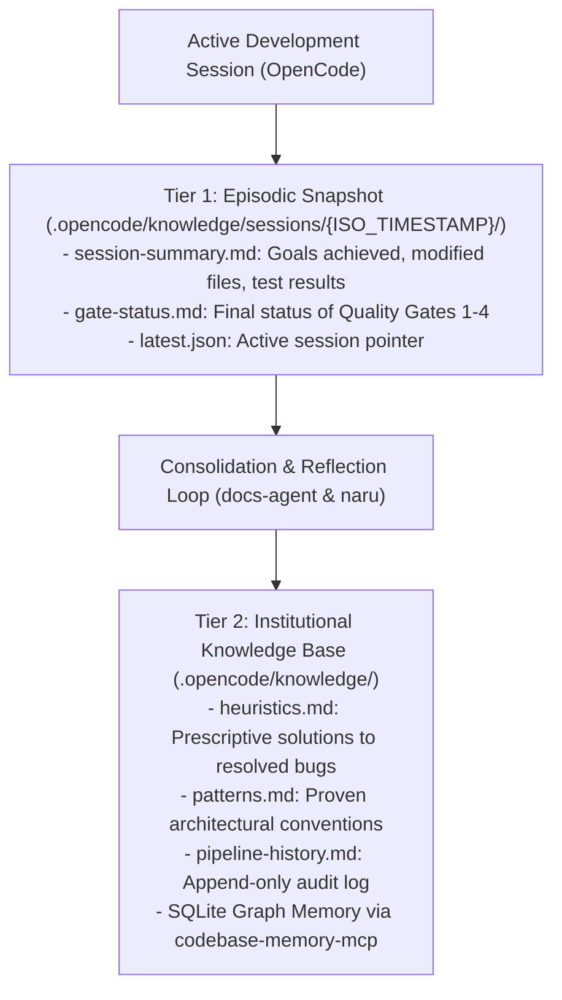

# Two-Tier Session Knowledge & Episodic Memory

N.A.R.U. implements a **Two-Tier Hierarchical Knowledge System** grounded in MemGPT research (Packer et al.) to retain architectural context, learned heuristics, and maintainability records across independent sessions.

---

## Architectural Topology



---

## Tier 1: Episodic Session Snapshots

At the conclusion of every development milestone, `docs-agent` writes an isolated episodic snapshot:
- **Path**: `.opencode/knowledge/sessions/{ISO_TIMESTAMP}/`
- **Files**:
  - `session-summary.md`: Record of user requests, modified files, execution duration, and test suites executed.
  - `gate-status.md`: Audit attestation for Quality Gates 1, 2, 3, and 4.
- **Active Pointer**: `.opencode/knowledge/sessions/latest.json`
  ```json
  {
    "last_session_id": "2026-08-21T22-15-00-000Z",
    "status": "SUCCESS",
    "version": "0.0.2",
    "platform": "web_fullstack"
  }
  ```

---

## Tier 2: Institutional Memory & SQLite Knowledge Graph

When recurring bugs are resolved or new architectural patterns are established:
1. **Heuristics Reflexion**: Naru appends root-cause learnings into `.opencode/knowledge/heuristics.md`.
2. **Entity Creation**: `docs-agent` invokes `codebase-memory-mcp` to call `create_entity` and `create_relation`, mapping domain components in the SQLite knowledge graph.
3. **Graph Persistence**: `docs-agent` calls `save_graph` to commit memory snapshots to disk, ensuring future development sessions automatically inherit institutional context.
