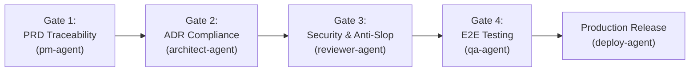

# Pipelines, Intent Taxonomies & 4 Quality Gates

N.A.R.U. governs autonomous multi-agent pipelines through **5 Intent Taxonomies** and **4 Strict Quality Gates**.

---

## Step 0: Intent Taxonomy & Dynamic Routing

Before delegating any task, Naru classifies user requests into one of 5 intent categories:

1. **`INTENT: GREENFIELD_CREATION`** (New Project from Scratch):
   - Invokes OpenCode's native `question` modal form for Category, Language, Database, Auth, and Deployment.
   - Delegates to `pm-agent` for Full Production Pipeline.
2. **`INTENT: FEATURE_MODIFICATION`** (Changes to Existing Project):
   - Reads `architecture-blueprint.md` and runs Standard Pipeline (Researcher → Dependency → Architect → Developer → Reviewer → QA → Docs).
3. **`INTENT: PRODUCTION_HOTFIX`** (Urgent Bugfix / Incident):
   - Runs Hotfix Pipeline (Hotfix-Agent → Reviewer → QA → Deploy).
4. **`INTENT: REPOSITORY_COLD_START`** (First-time Workspace Initialization):
   - Runs Cold-Start Pipeline (`naru init repo`) to scan via 5-MCP, generate architecture blueprints, and seed graph memory.
5. **`INTENT: INSTANT_DIAGNOSTIC`** (General Inquiry / Code Q&A):
   - Answered directly by Naru using Serena LSP or Codebase Memory without spinning up subagent pipelines.

---

## The 4 Quality Gates

### Quality Gate 1: Requirement Completeness & Traceability
- **Owner**: `pm-agent`
- **Mandate**: Every user story must be assigned an immutable Acceptance Criteria ID (`AC-XX`). Unscoped feature requests are staged in `backlog.md`.

### Quality Gate 2: Architecture Decision Compliance
- **Owner**: `architect-agent`
- **Mandate**: Every module and dependency must be mapped in the Goal Traceability Matrix and backed by an Architecture Decision Record (`ADR-XXX`).

### Quality Gate 3: Security, Drift & Anti-Slop Audit
- **Owner**: `reviewer-agent` (Ox Alpha Free [max reasoning])
- **Mandate**: Static analysis against OWASP Top 10, zero dead code mandate (Knip standard), and anti-slop frontend craftsmanship check.

### Quality Gate 4: Production Readiness & Verification
- **Owner**: `qa-agent` (MiMo V2.5 [Vision OCR])
- **Mandate**: Playwright automated E2E test execution, visual regression OCR diffing, packet flood fuzzing, and flaky test quarantine.
